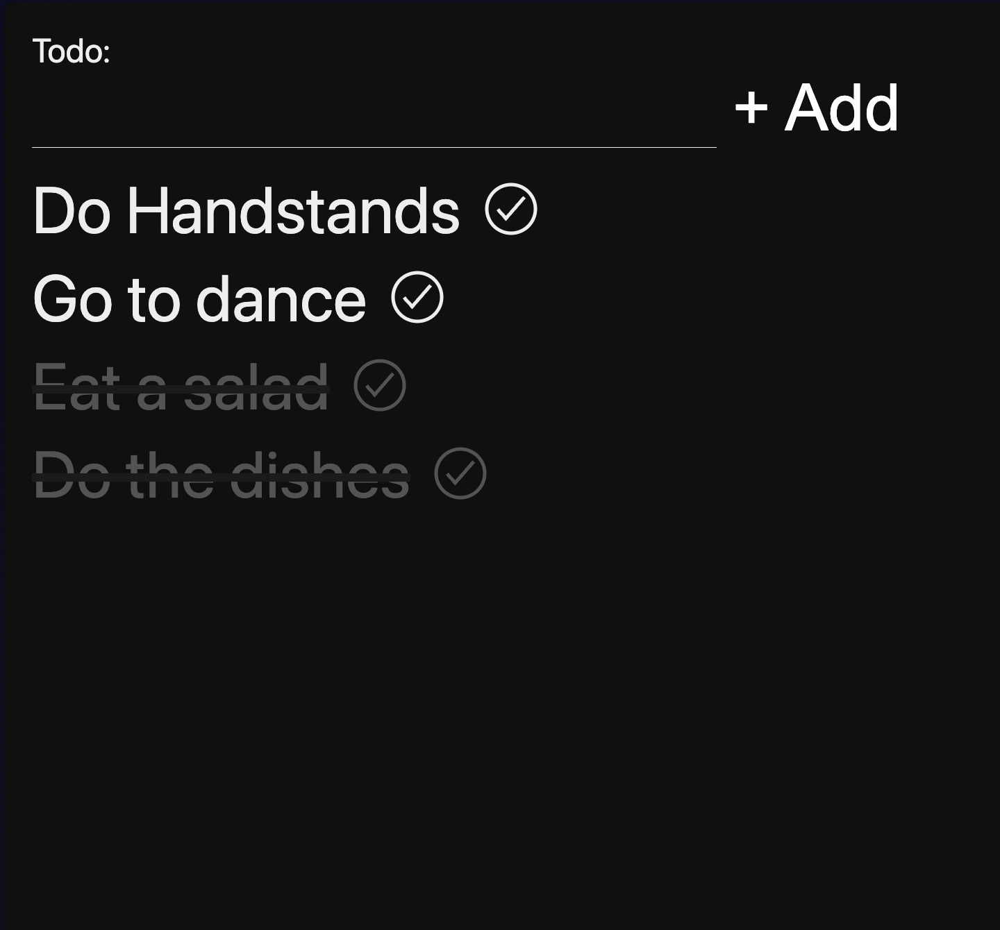

# Local First w/ Replicache

Demo: https://48802821.local-first-replicache-without-sync.pages.dev/

https://www.youtube.com/@syntaxfm

This is the repo for the syntax.fm tutorial on Local First with Replicache. In this codebase we show how to use Replicache in a Svelte.

This is part 1 of 2, where we get our app working without a server side sync. Part 2 will cover working with a database and a syncing server.

